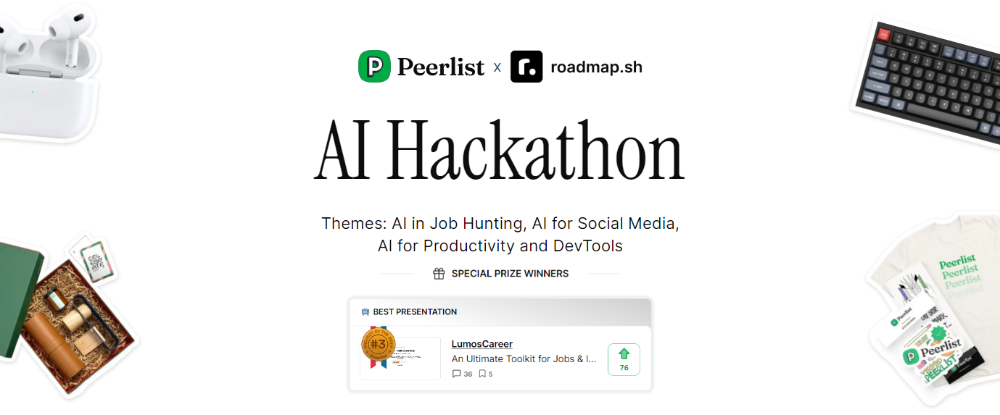

# LumosCareer 

 

## Project Description

_LumosCareer_ is an innovative web application designed to assist job seekers in crafting the perfect job application. Our tool leverages advanced natural language processing (NLP) and machine learning technologies to provide comprehensive support through various stages of the job application process. Here's a detailed overview of what LumosCareer offers:

## Key Features

1. **Job Description Summarization**:

   - Users can input a job description, and our app will generate a concise summary highlighting the key points. This helps job seekers quickly understand the most important aspects of a job listing.

2. **Resume Analysis**:

   - LumosCareer analyzes uploaded resumes against a given job description to evaluate how well they match. The analysis includes:
     - _Matching Score_: A percentage score indicating how well the resume matches the job description.
     - _Missing Keywords_: Identifies important keywords from the job description that are missing in the resume.
     - _Profile Summary_: A summary highlighting the strengths and relevance of the resume to the job description.
     - _ATS Friendliness_: Assesses how well the resume is likely to perform with Applicant Tracking Systems (ATS).
     - _Suggestions for Improvement_: Recommendations on what to remove, add, and improve in the resume.

3. **Cover Letter Generation**:

   - Based on the job description and the resume, the app generates a personalized cover letter tailored to the specific job. This ensures the cover letter aligns with both the applicant’s qualifications and the employer’s needs.

4. **Interview Guide Generation**:

   - Provides a customized interview guide based on the job description and resume. This includes potential interview questions and tips on how to prepare for them, helping candidates feel more confident and prepared.

5. **Resume Generation**:
   - After analyzing the resume, users can generate an updated resume incorporating all the suggested improvements. The new resume is presented in an HTML format, ready to be copied and used.

## Tech Stack

- **Frontend**: React, NextJs, Shadcn, Tailwindcss
- **BaaS**: Appwrite✨[Auth, Databases, Storage], Vercel
- **Backend**: Python, Flask, NGINX, Azure VM
- **Natural Language Processing**: Integrates with Gemeni for content generation and analysis
- **File Handling**: Utilizes Python libraries for PDF text extraction

<h2>Peerlist AI Hackathon winner</h2>

> This project was created during the [Peerlist x roadmap.sh AI Hackathon 2024](https://peerlist.io/hackathons/peerlist-roadmap-hackathon), where we won the <i>"Best Presentation"</i> track.

> Additionally, lumoscareer was one of the <i>Top 3 projects of Week 25</i> in 2024 for [Project Spotlight Series](https://peerlist.io/vinayakgavariya/project/lumoscareer) by Peerlist.

## Vision

LumosCareer aims to empower job seekers by providing them with the tools and insights they need to present their best selves to potential employers. By leveraging cutting-edge technology, we strive to make the job application process more efficient, effective, and successful.

Whether you’re a seasoned professional or just starting your career journey, LumosCareer is here to light your way to success. 🌟
